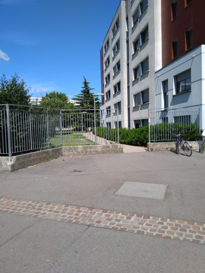
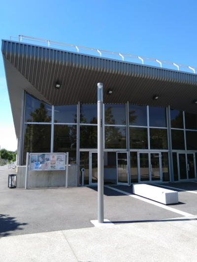

 

All the talks will take place at the "Amphithéâtre Fourier" located at the INSA engineer school (see pictures below).

From the centre of Toulouse the simplest way to get to the INSA is to take the metro. Toulouse has two metro lines. "Ligne A" and "Ligne B".

The INSA is located next to the "Faculté de Pharmacie" metro station, located on "ligne B".

From the centre you can take the metro at Jean Jaurès station (5 minutes walk from the hotels) and take the "Ligne B" in the Direction "Ramonville". Once you get out at "Faculté de Pharmacie" you should turn on your left and follow the path represented in the map below from place A to B (count 5-10 minutes walk):

 

<iframe src="https://www.google.com/maps/d/embed?mid=1fZ3lBxXZF_ksWhJ6hhLtyPib9Mmg8UpJ" width="640" height="480"></iframe>

 

Here is how it should look like when you come out of the metro:

 

Here is how the entrance of INSA should look like:

Here is how the entrance of the "Amphithéâtre Fourier" looks like:

 

